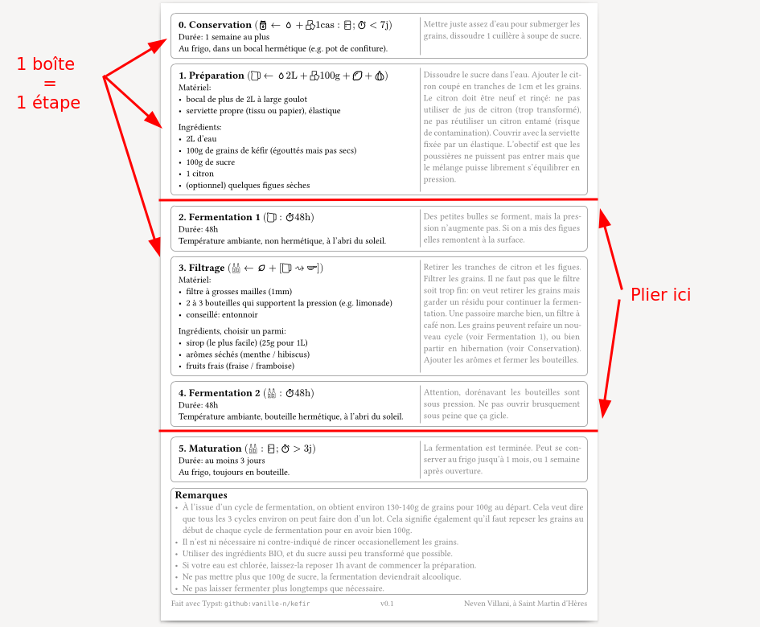
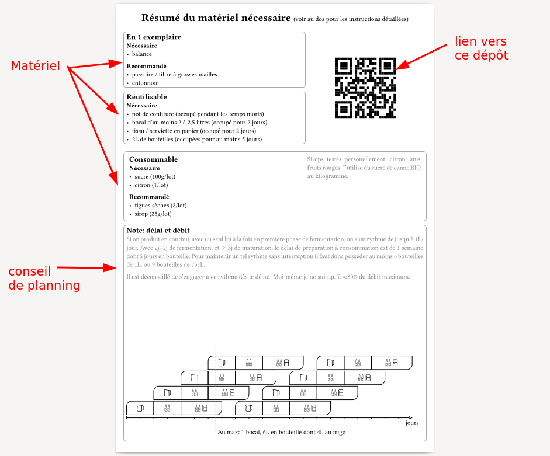

# Kefir -- Recette

## Compiler le document

```sh
$ just
```
ou bien
```sh
$ typst compile pamphlet.typ
```


## Organisation





## Apporter des modifications

Compiler en mode interactif
```sh
$ just watch
```
puis éditer `pamphlet.typ`.

